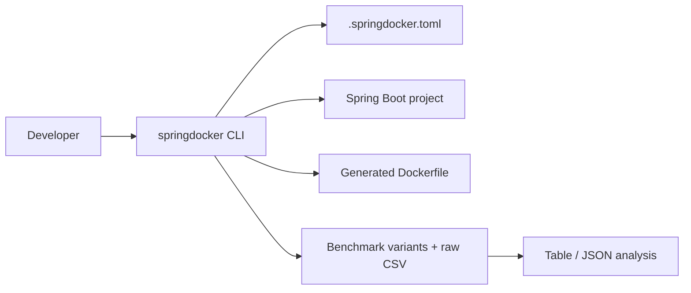

# springdocker

[](https://github.com/mnafshin/springdocker/actions/workflows/ci.yml)
[](https://github.com/mnafshin/springdocker/actions/workflows/release.yml)
[](https://github.com/astral-sh/ruff)
[](./pyproject.toml)
[](./docs/benchmark-methodology.md)

Developer toolkit for Spring Boot containerization with optional benchmark evidence for tuning decisions.

`springdocker` is a Python CLI that helps you inspect a Spring Boot project, generate a Dockerfile, create benchmark assets, run benchmark suites, and summarize benchmark results.

See [`docs/POSITIONING.md`](docs/POSITIONING.md) for product scope, **CI-evidenced guarantees**, and how the sample projects relate to shipped behavior.

## Project naming

**springdocker** is the canonical name for this project — use it when searching GitHub or PyPI, installing the package, or running the CLI.

| Surface | Name |
|---|---|
| GitHub repository | [`mnafshin/springdocker`](https://github.com/mnafshin/springdocker) |
| PyPI package / `pip install` | `springdocker` |
| CLI command | `springdocker` |
| Config file | `.springdocker.toml` |

The string **`java-spring-docker`** appears only in the benchmark sample app, not in the CLI package:

| Surface | Path or coordinates | Role |
|---|---|---|
| Sample app directory | `samples/java-spring-docker/` | Full Spring Boot app for benchmark scenarios and evidence |
| Sample Maven/Gradle artifact | `io.github.mnafshin:java-spring-docker` | Demo application identity inside that sample |

Those sample names predate the **springdocker** product name. They do not affect installation (`pip install springdocker`) or CLI usage. Your local clone directory can be named anything.

## Why springdocker instead of Jib or Buildpacks?

- **Jib** and **Buildpacks** optimize for build convenience and opaque image assembly.
- **springdocker** optimizes for teams that want a **real Dockerfile they can own, read, and edit**.
- It combines explicit Dockerfile generation with explainability and verification workflows.

See [`docs/POSITIONING.md`](docs/POSITIONING.md) for the detailed comparison and tradeoffs.

## Architecture



See `docs/architecture.md` for the detailed module map and command lifecycle.

The repo is split into these main surfaces:

- `src/springdocker/` - installable CLI package and core implementation.
- `cli/README.md` - command reference and configuration details.

See [Sample project map](#sample-project-map) for which Spring Boot path to use.

## What it does

**Shipped and CI-validated:** project detection, config, Dockerfile generation, explain/verify commands, and benchmark asset/analyzer plumbing (see [`docs/POSITIONING.md`](docs/POSITIONING.md#shipped-guarantees-ci-evidenced)).

**Optional / sample-anchored:** full benchmark runs, performance comparison tables, and reference evidence under `samples/java-spring-docker/`.

- Detects Maven or Gradle projects.
- Writes a starter `.springdocker.toml` config.
- Generates Dockerfiles with opinionated Spring Boot defaults.
- Pins generated base images by digest when known.
- Creates benchmark variants and runs benchmark suites (requires Docker and `[benchmark]` extra).
- Summarizes benchmark CSV output as a table or JSON.

Digest pins are centralized in `src/springdocker/digest_pins.py` and verified in CI.
Runbook: [`docs/digest-pin-runbook.md`](docs/digest-pin-runbook.md) · Renovate template: [`.github/renovate.json`](.github/renovate.json)

## Sample project map

| Path | Role | Use when |
|---|---|---|
| `tests/fixtures/{maven-only,gradle-only}/` | Minimal Spring Boot apps for CLI walkthroughs and CI | Learning the CLI, trying Dockerfile generation, or extending tests ([`docs/golden-samples.md`](docs/golden-samples.md)) |
| `samples/java-spring-docker/` | Benchmark harness + evidence | Running benchmark scenarios and comparing `raw.csv` results |

Gradle walkthroughs use `tests/fixtures/gradle-only/` with the same commands below (Maven: `tests/fixtures/maven-only/`).

See [`docs/decisions/95-sample-project-strategy.md`](docs/decisions/95-sample-project-strategy.md) for why the former `examples/` walkthrough tree was removed.

## Quick start

```bash
cd /path/to/your-repo
python3 -m venv .venv
. .venv/bin/activate
python3 -m pip install -e .
python3 -m pip install -e '.[benchmark]'

# Dockerfile workflow — start with tests/fixtures/
springdocker doctor --project-root tests/fixtures/maven-only
springdocker init --project-root tests/fixtures/maven-only --build-tool maven
springdocker inspect --project-root tests/fixtures/maven-only --format json
springdocker dockerfile generate --project-root tests/fixtures/maven-only --output Dockerfile.generated --recipe jvm-balanced
springdocker explain --project-root tests/fixtures/maven-only Dockerfile.generated --format json
springdocker verify --project-root tests/fixtures/maven-only Dockerfile.generated

# Benchmark workflow — use the full sample app under samples/
springdocker benchmark generate --project-root samples/java-spring-docker --java-version 25
springdocker benchmark run --project-root samples/java-spring-docker --profile quick
springdocker benchmark analyze --project-root samples/java-spring-docker samples/java-spring-docker/benchmarks/03-custom-jre-jlink/results/raw.csv --format table
springdocker benchmark compare --project-root samples/java-spring-docker samples/java-spring-docker/benchmarks/03-custom-jre-jlink/results/raw.csv --baseline-variant with-jlink-runtime
springdocker benchmark analyze --project-root samples/java-spring-docker samples/java-spring-docker/benchmarks/06-base-image-choice/results/raw.csv --baseline samples/java-spring-docker/benchmarks/06-base-image-choice/results/baseline.json
```

## CLI workflow

1. `doctor` checks the project root and build tool.
2. `init` writes a starter config file.
3. `dockerfile generate` writes a Dockerfile to the requested path.
4. `benchmark generate` creates benchmark scenarios.
5. `benchmark run` executes the benchmark runner.
6. `benchmark analyze` turns `raw.csv` into a table or JSON summary.

See `cli/README.md` for the command reference and config precedence rules.

## Benchmark methodology

See `docs/benchmark-methodology.md` for the benchmark model, run profiles, and summary calculations.

Benchmarks are an optional evidence subsystem and require benchmark extras (`springdocker[benchmark]`).

The sample project keeps benchmark scenarios under `samples/java-spring-docker/benchmarks/`.
Generated variant Dockerfiles and most run output are **gitignored** — regenerate with `springdocker benchmark generate` and `springdocker benchmark run`.
Versioned reference datasets and the scenario 06 CI regression baseline live under `samples/java-spring-docker/benchmarks/reference/` and `06-base-image-choice/results/`.
See `samples/java-spring-docker/benchmarks/README.md` for the full artifact policy.

### Benchmark scenario index

Authoritative list of generated scenarios under `samples/java-spring-docker/benchmarks/`.
Regenerate directories with `springdocker benchmark generate`. Scenario **07** is listed after **06** and before **08** by id, even though the generator emits **08** before the native scaffold.

| ID | Directory | Purpose | Variants | Further reading |
|---|---|---|---|---|
| 01 | `01-multi-stage-build-structure` | Multi-stage Dockerfile layout vs a simpler two-stage build | `specialized-multi-stage`, `simple-two-stage` | [`benchmark-methodology.md`](docs/benchmark-methodology.md#current-sample-comparison-snapshot) |
| 02 | `02-buildkit-gradle-cache` | BuildKit cache mount on dependency rebuilds | `with-buildkit-cache`, `without-buildkit-cache` | [`benchmark-methodology.md`](docs/benchmark-methodology.md#current-sample-comparison-snapshot) |
| 03 | `03-custom-jre-jlink` | jlink vs vendor JRE on debian-slim vs stock Temurin image | `with-jlink-runtime`, `without-jlink-runtime`, `temurin-jre-image` | [`jvm-optimization.md`](docs/jvm-optimization.md), [`golden-samples.md`](docs/golden-samples.md) |
| 04 | `04-jep483-aot-cache` | JEP 483 ahead-of-time class-loading cache (Java 24+) | `with-aot-cache`, `without-aot-cache` | [`jvm-optimization.md`](docs/jvm-optimization.md) · extra runs: 8 (`quick`) / 15 (`full`) |
| 05 | `05-jvm-container-flags` | Tuned vs baseline JVM container flags | `tuned-flags`, `defaults-like` | [`jvm-optimization.md`](docs/jvm-optimization.md) |
| 06 | `06-base-image-choice` | Runtime base image tradeoffs (jlink on every base) | `alpine`, `debian-slim`, `ubuntu`, `distroless` (configurable) | [`benchmark-methodology.md`](docs/benchmark-methodology.md#configuring-base-image-variants-scenario-06) · CI regression baseline |
| 07 | `07-native-benchmark` | Native-image scaffold (`native-aot` recipe); skipped by default | _(single Dockerfile at scenario root — no variant dirs)_ | [`native-image-roadmap.md`](docs/native-image-roadmap.md) |
| 08 | `08-appcds` | AppCDS shared archive at build time | `with-appcds`, `without-appcds` | [`jvm-optimization.md`](docs/jvm-optimization.md) |

Example analyze commands (after `benchmark run`):

```bash
springdocker benchmark analyze --project-root samples/java-spring-docker \
  benchmarks/03-custom-jre-jlink/results/raw.csv --format table
springdocker benchmark analyze --project-root samples/java-spring-docker \
  benchmarks/04-jep483-aot-cache/results/raw.csv --format json
springdocker benchmark compare --project-root samples/java-spring-docker \
  benchmarks/03-custom-jre-jlink/results/raw.csv --baseline-variant with-jlink-runtime
```

Current reports focus on:

- image size
- build duration
- startup latency
- success rate

Benchmark summaries can be rendered as:

- terminal tables
- JSON

## Supported stack

| Layer | CI / fixtures | Reference sample (`samples/java-spring-docker/`) |
|---|---|---|
| Python CLI | 3.10–3.12 tested in CI | — |
| Build tools | Maven and Gradle (minimal fixtures + examples) | Maven and Gradle |
| Spring Boot | Projects with Spring Boot markers | 4.0.1 |
| Java in generated Dockerfiles | ≥17 (generator validation) | 25 default in sample config |

The reference sample uses bleeding-edge versions to stress-test generator output and benchmark scenarios. Your project does not need to match those versions to use the CLI.

## Project docs

### Implemented docs

- `docs/project-detection.md` — Maven/Gradle detection boundaries and monorepo workflows
- `docs/POSITIONING.md` — product scope, CI guarantees, sample-tree strategy
- `docs/digest-pin-runbook.md`
- `docs/architecture.md`
- `docs/benchmark-methodology.md`
- `docs/golden-samples.md`
- `docs/extensions.md`
- `docs/security-hardening.md`
- `docs/observability.md`
- `docs/kubernetes.md`
- `docs/adr/README.md`
- `docs/multiarch.md`
- `docs/onboarding.md`
- `docs/troubleshooting.md`
- `docs/jvm-optimization.md`
- `SECURITY.md`
- `CONTRIBUTING.md`

### Roadmap docs (not implemented yet)

- `docs/example-gallery.md`
- `docs/benchmark-dashboard.md`
- `docs/native-image-roadmap.md`
- `docs/distribution.md`
- `docs/compatibility-matrix.md`

## Comparison with adjacent tools

| Tool | Focus | What springdocker adds |
|---|---|---|
| Jib | Dockerless image build | benchmark-aware Dockerfile and runtime tuning workflows |
| Buildpacks | Opinionated platform build | explicit Dockerfile generation and benchmark artifacts |
| Manual Dockerfiles | Full control | project detection, config, and repeatable benchmark analysis |

## Sample project docs

- `docs/golden-samples.md` - fixture walkthroughs, CI coverage, and variant coverage
- `samples/java-spring-docker/README.md` - full benchmark sample app
- `samples/java-spring-docker/HELP.md`
- `samples/java-spring-docker/k8s/kustomization.yaml`
- `samples/java-spring-docker/tools/README.md`

## Contributing

The main package is under `src/springdocker/`. Run `pytest`, `ruff check src tests`, and `mypy src` before pushing changes.
